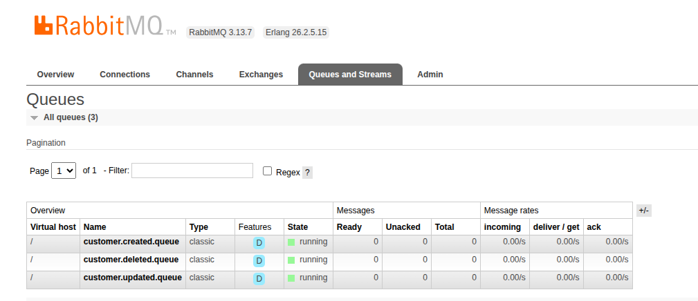
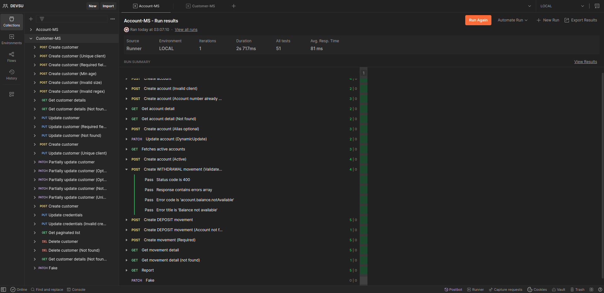
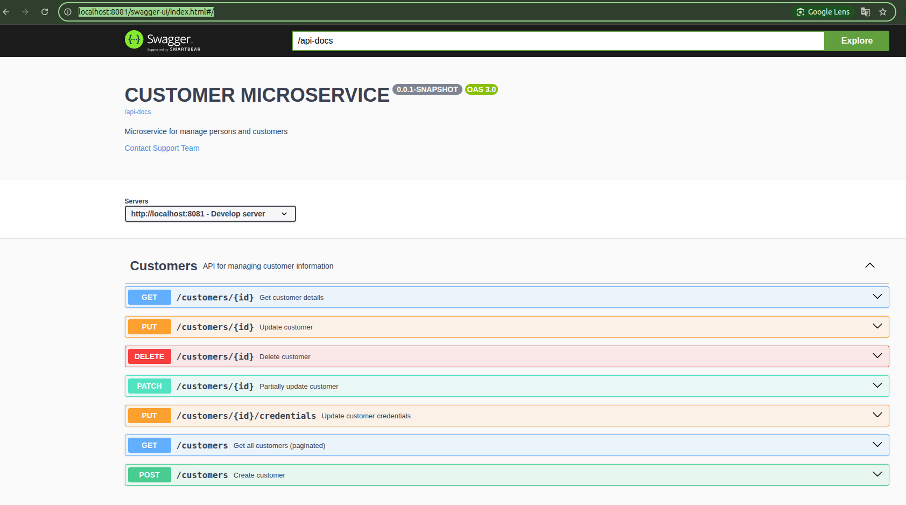

# customer-microservice
Microservicio que gestiona la información de los clientes, al momento de crear/actualizar/eliminar se establece una 
conexión async con el MS de cuentas para registrar al cliente. Esta API cuenta con un CRUD `/customers`. La API
fue desarrollada con Java y Spring Boot, y Postgres como Gestor de base de datos, siguiendo una arquitectura hexagonal y DDD.
Se implementaron pruebas con Postman y algunas pruebas unitarias.

### Levantar los microservicios
- Se puede levantar los microservicios en local
- O se puede con docker levantar toda la infraestructura desde el proyecto/carpeta `infra`
Esta variante se encuentra detallada en `infra/README.md`

### Set-up desde el IDE
1.  Instalar rabbitmq con docker
    ```bash
    docker run -d --name rabbitmq \
      -p 5672:5672 -p 15672:15672 \
      -e RABBITMQ_DEFAULT_USER=guest \
      -e RABBITMQ_DEFAULT_PASS=guest \
      rabbitmq:3-management
    ```
    Obtener la IP para establecer la variable de entorno `RABBITMQ_PORT`:
    ```bash
    docker inspect -f '{{range.NetworkSettings.Networks}}{{.IPAddress}}{{end}}' rabbitmq
    ```
    Comprobar desde la consola web de rabbit: http://localhost:15672

2. Instalar postgres y crear la base de datos `db_customers_test`

3. Levantar el MS. 

    Clonar desde: [git@github.com:grleyvaj/customer-microservice.git](git@github.com:grleyvaj/customer-microservice.git)

    Al correr el MS se ejecutarán en automático las migraciones de DB con las tablas y datos iniciales. 
    También se creará el `exchange` y `colas`
    

4. Probar desde Posmtan o Swagger que se documentan en la siguiente sección

## Suite de pruebas con postman
Se implementaron pruebas con JS en postman

Esta documentación la puede ejecutar importando los archivos que se encuentran en la carpeta de `/documentation`

Colección:
[Customer-API.postman_collection.json](documentation/Customer-MS.postman_collection.json)
Variables de entorno LOCAL para postman: [LOCAL.postman_environment.json](documentation/LOCAL.postman_environment.json)

## Documentación de la API
Al levantar la aplicación, puede visualizar la documentación en: http://localhost:8081/swagger-ui/index.html#/

La API fue documentada en EN y en ES, lo cual puede configurar con la variable de entorno `OPENAPI_LANGUAGE`
- Inglés(por defecto): `i18n/swagger_messages.properties`
- Español: `i18n/swagger_messages.properties_es`

La api first está adjunta en la carpeta `/documentation`: [open-api.yml](documentation/open-api.yml)

### Comando útiles de docker para rabbit (opcional: solo si se requiere limpiar)
Detener rabbit:
```bash
    docker stop rabbitmq
```
Eliminar rabbit:
```bash
    docker rm rabbitmq
```
